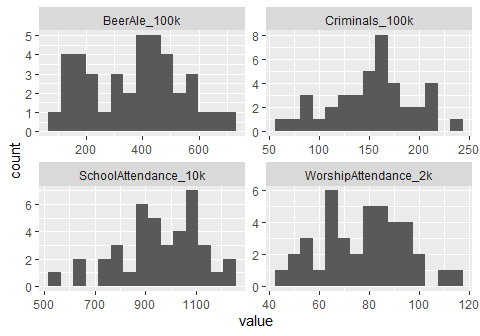
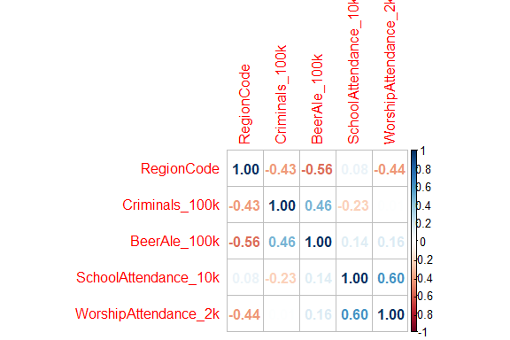
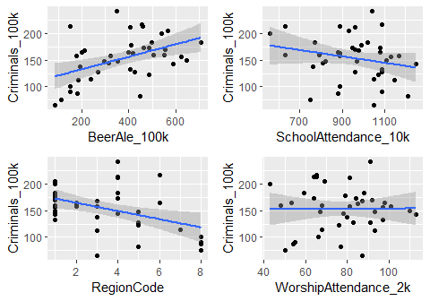
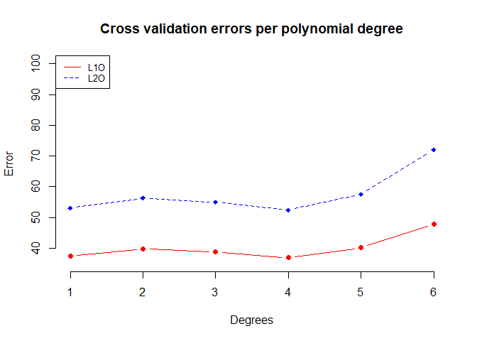
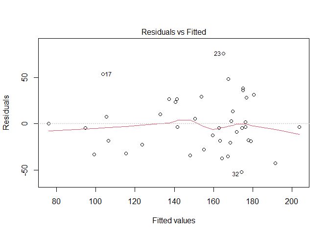
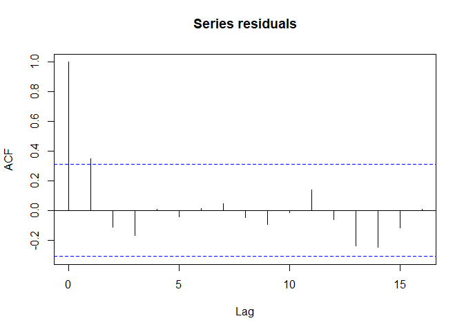
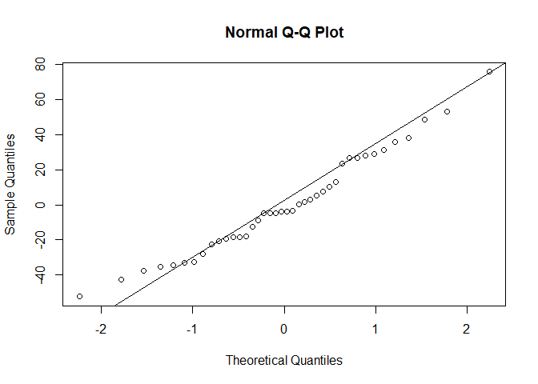

# Introduction

We as human beings like to divide actions into moral and amoral. Some of these amoral actions, such as murder, theft and fraud, are codified in law and we call those transgressions crimes. It is in our best interest to avoid crime happening. Therefore, we try to punish those that commit them in hopes of it being a deterrent for future repetition. However, there might be other ways in which to minimise crime. In addition, we see that crime isn't happening uniformly everywhere. This leads us to the question: what makes a crime more likely to happen in a region?\
Clay[1857], concentrating on crime in England, analysed the following characteristics: Beer-(ale)-house numbers, worship attendance and public school attendance. The argument he provides for the latter two, is both allow for the public access to Christian moral values (although he criticises that the ability to read on its own is not enough). It is to note, the "public schools" mentioned by Clay concentrated mostly on teaching read and writing and were not free but accepted anyone who could effort it. In the case of beer-houses, he argues "the temptation to animal pleasure" corrupts a person. To help his case he tries to show the positive correlation of beer-houses, the negative correlations of public school and worship attendance to crime.\
In this paper we want to verify (or deny) these effects of the aforementioned characteristics and try to predict crime rate from them using the same data set. However, before starting it is important to mention, as noticed by Clay[1857], the recorded crime rate may be inaccurate because of systematic reasons since each county handles crime and punishment differently on the executive and juridical levels. This will impact the accuracy of all possible analysis and models.

# Exploratory Data Analysis

We begin our analysis with a look at the first few lines of our dataset.


|County    |RegionName   | RegionCode| Criminals_100k| BeerAle_100k| SchoolAttendance_10k| WorshipAttendance_2k|
|:---------|:------------|----------:|--------------:|------------:|--------------------:|--------------------:|
|Middlesex |SouthEastern |          1|            200|          541|                  560|                   43|
|Surrey    |SouthEastern |          1|            160|          504|                  630|                   48|
|Kent      |SouthEastern |          1|            160|          552|                  790|                   68|
|Sussex    |SouthEastern |          1|            147|          295|                  820|                   67|
|Hants     |SouthEastern |          1|            178|          409|                  990|                   79|
|Berks     |SouthEastern |          1|            205|          568|                  930|                   69|


```
## Data summary:
```


|   |County           |Region Name      |Region Code  |Criminals per 100k population |Ale/Beer Houses per 100k |Attendants @ school per 10k |Attendants @ public worship per 2000 |
|:--|:----------------|:----------------|:------------|:-----------------------------|:------------------------|:---------------------------|:------------------------------------|
|   |Length:40        |Length:40        |Min.   :1.00 |Min.   : 66.0                 |Min.   : 87.0            |Min.   : 560.0              |Min.   : 43.0                        |
|   |Class :character |Class :character |1st Qu.:1.00 |1st Qu.:127.0                 |1st Qu.:209.0            |1st Qu.: 880.0              |1st Qu.: 65.0                        |
|   |Mode  :character |Mode  :character |Median :3.00 |Median :157.5                 |Median :407.0            |Median : 965.0              |Median : 79.5                        |
|   |NA               |NA               |Mean   :3.45 |Mean   :152.9                 |Mean   :374.9            |Mean   : 957.8              |Mean   : 77.5                        |
|   |NA               |NA               |3rd Qu.:5.00 |3rd Qu.:174.2                 |3rd Qu.:490.8            |3rd Qu.:1082.5              |3rd Qu.: 91.0                        |
|   |NA               |NA               |Max.   :8.00 |Max.   :241.0                 |Max.   :708.0            |Max.   :1250.0              |Max.   :113.0                        |

The dataset contains information about 40 different counties.`County` and `RegionName` are categorical variables, and each of the 8 regions is assigned a `RegionCode`, which is a number from 1 to 8. `Criminals_100k` is the number of criminals per 100,000 inhabitants for any particular county. Similarly, `BeerAle_100k`, `SchoolAttendance_10k` and `WorshipAttendance_2k` are social indicators measured numerically as a proportion of the population. In order to better visualise the numerical data, we plot histograms of each numerical variable, with the exception of the categorical `RegionCode`.



The `BeerAle_100k` variable appears to be bimodal. The histogram suggests that there are two common levels of alcohol consumption within the entire population, one around the 200, and another around 400 per 100,000 population. According to the data summary, `Crimanals_100k` has a mean of 152.9 and a median of 157.5, suggesting the symmetry that is also reflected in the histogram. `SchoolAttendance_10k` is slightly left skewed, while `WorshipAttendance_2k` has a varied but loosely symmetric distribution.

The linear dependence between each pair of numeric variables is expressed in the following correlation matrix:



There appears to be negligible linear dependence between worship attendance and criminality. School attendance is slightly negatively correlated with the prevalence of crime. Criminal behaviour is positively correlated with `BeerAle_100k` with a correlation coefficient of 0.46, suggesting that counties with a more dominant culture of frequenting bars and pubs are also where more crime happens. In order to better visualise these dependencies, we regress `Criminals_100k` on each of these variables.



There appears to be a very clear linear dependence of criminal behaviour on bar attendance, with most datapoints falling within the 95% confidence interval of the regression line. There is high variation of criminality across school attendance and worship attendance.

## Model Fitting

The model is fitted using polynomial regression. In order to predict Criminals per 100k population, we use a polynomial regression model which uses Ale/Beer Houses per 100k, Attendants \@ school per 10k, and Attendants \@ public worship per 2000 as the features. We include the variable Attendants \@ public worship per 2000 in our analysis even if it has no correlation with the variable Criminals per 100k as no correlation doesn't mean no causation, it only suggests that there is no linear association.

Mathematically, the model can be represented as:

A polynomial regression model of degree n with three features (x1, x2, x3) can be represented as follows:

$y = \beta_0 + \beta_{11}x_1 + \beta_{12}x_1^2 + ... + \beta_{1n}x_1^n + \beta_{21}x_2 + \beta_{22}x_2^2 + ... + \beta_{2n}x_2^n + \beta_{31}x_3 + \beta_{32}x_3^2 + ... + \beta_{3n}x_3^n + \epsilon$

Where:

y is Criminals per 100k population x1, x2, x3 are the independent variables [Ale/Beer Houses per 100k, Attendants \@ school per 10k, and Attendants \@ public worship per 2000] β0, βij are the coefficients of the model where i is the feature index and j is the degree of the polynomial ε is the error term

We choose the model based on the Exploratory data analysis and the correlation between the features and the target variable. On top of the linear relation, we also add polynomial terms to capture the non-linear relation between the features and the target variable.


The graph below shows the errors for different polynomial degrees up to 6 using cross-validation

<!-- -->

We choose the degree of the polynomial based on the leave-one-out and leave-two-out cross-validations results, that we run on polynomials of degrees up to 6, where we keep the two best performing models, namely the polynomial regressions of degrees 3 and 4 and compare them to the linear model (with degree 1) using Information Criteria. We get the following results :


Table: Information Criteria

|                    | DF|      AIC|      BIC|
|:-------------------|--:|--------:|--------:|
|Linear model        |  5| 405.0249| 413.4693|
|Degree 3 polynomial | 11| 402.5364| 421.1140|
|Degree 4 Polynomial | 14| 401.7266| 425.3710|


We can see that the two unrestricted models fit better the data than the simpler linear model. Using the likelihood ratio test, we compare them and with a p-value of  we fail to reject the null hypothesis at a 5% significance level that the restricted linear model fits better the data and we keep the restricted model. Therefore, the polynomial model of degree 3 provides a significantly better fit to the data.

Then, we run a stepwise selection to compare all possible models and pick the one that fits data the best 


Here are the summary statistics of the model

  
<table style="border-collapse:collapse; border:none;">
<tr>
<th style="border-top: double; text-align:center; font-style:normal; font-weight:bold; padding:0.2cm;  text-align:left; ">&nbsp;</th>
<th colspan="3" style="border-top: double; text-align:center; font-style:normal; font-weight:bold; padding:0.2cm; ">Criminals_100k</th>
</tr>
<tr>
<td style=" text-align:center; border-bottom:1px solid; font-style:italic; font-weight:normal;  text-align:left; ">Predictors</td>
<td style=" text-align:center; border-bottom:1px solid; font-style:italic; font-weight:normal;  ">Estimates</td>
<td style=" text-align:center; border-bottom:1px solid; font-style:italic; font-weight:normal;  ">CI</td>
<td style=" text-align:center; border-bottom:1px solid; font-style:italic; font-weight:normal;  ">p</td>
</tr>
<tr>
<td style=" padding:0.2cm; text-align:left; vertical-align:top; text-align:left; ">(Intercept)</td>
<td style=" padding:0.2cm; text-align:left; vertical-align:top; text-align:center;  ">1257.04</td>
<td style=" padding:0.2cm; text-align:left; vertical-align:top; text-align:center;  ">&#45;13.62&nbsp;&ndash;&nbsp;2527.70</td>
<td style=" padding:0.2cm; text-align:left; vertical-align:top; text-align:center;  ">0.052</td>
</tr>
<tr>
<td style=" padding:0.2cm; text-align:left; vertical-align:top; text-align:left; ">BeerAle 100k</td>
<td style=" padding:0.2cm; text-align:left; vertical-align:top; text-align:center;  ">0.44</td>
<td style=" padding:0.2cm; text-align:left; vertical-align:top; text-align:center;  ">0.12&nbsp;&ndash;&nbsp;0.77</td>
<td style=" padding:0.2cm; text-align:left; vertical-align:top; text-align:center;  "><strong>0.008</strong></td>
</tr>
<tr>
<td style=" padding:0.2cm; text-align:left; vertical-align:top; text-align:left; ">SchoolAttendance 10k</td>
<td style=" padding:0.2cm; text-align:left; vertical-align:top; text-align:center;  ">&#45;7.32</td>
<td style=" padding:0.2cm; text-align:left; vertical-align:top; text-align:center;  ">&#45;13.03&nbsp;&ndash;&nbsp;-1.62</td>
<td style=" padding:0.2cm; text-align:left; vertical-align:top; text-align:center;  "><strong>0.014</strong></td>
</tr>
<tr>
<td style=" padding:0.2cm; text-align:left; vertical-align:top; text-align:left; ">WorshipAttendance 2k</td>
<td style=" padding:0.2cm; text-align:left; vertical-align:top; text-align:center;  ">39.03</td>
<td style=" padding:0.2cm; text-align:left; vertical-align:top; text-align:center;  ">0.07&nbsp;&ndash;&nbsp;77.99</td>
<td style=" padding:0.2cm; text-align:left; vertical-align:top; text-align:center;  "><strong>0.050</strong></td>
</tr>
<tr>
<td style=" padding:0.2cm; text-align:left; vertical-align:top; text-align:left; ">BeerAle 100k^2</td>
<td style=" padding:0.2cm; text-align:left; vertical-align:top; text-align:center;  ">&#45;0.00</td>
<td style=" padding:0.2cm; text-align:left; vertical-align:top; text-align:center;  ">&#45;0.00&nbsp;&ndash;&nbsp;-0.00</td>
<td style=" padding:0.2cm; text-align:left; vertical-align:top; text-align:center;  "><strong>0.040</strong></td>
</tr>
<tr>
<td style=" padding:0.2cm; text-align:left; vertical-align:top; text-align:left; ">SchoolAttendance 10k^2</td>
<td style=" padding:0.2cm; text-align:left; vertical-align:top; text-align:center;  ">0.01</td>
<td style=" padding:0.2cm; text-align:left; vertical-align:top; text-align:center;  ">0.00&nbsp;&ndash;&nbsp;0.01</td>
<td style=" padding:0.2cm; text-align:left; vertical-align:top; text-align:center;  "><strong>0.014</strong></td>
</tr>
<tr>
<td style=" padding:0.2cm; text-align:left; vertical-align:top; text-align:left; ">WorshipAttendance 2k^2</td>
<td style=" padding:0.2cm; text-align:left; vertical-align:top; text-align:center;  ">&#45;0.49</td>
<td style=" padding:0.2cm; text-align:left; vertical-align:top; text-align:center;  ">&#45;0.99&nbsp;&ndash;&nbsp;0.01</td>
<td style=" padding:0.2cm; text-align:left; vertical-align:top; text-align:center;  ">0.056</td>
</tr>
<tr>
<td style=" padding:0.2cm; text-align:left; vertical-align:top; text-align:left; ">SchoolAttendance 10k^3</td>
<td style=" padding:0.2cm; text-align:left; vertical-align:top; text-align:center;  ">&#45;0.00</td>
<td style=" padding:0.2cm; text-align:left; vertical-align:top; text-align:center;  ">&#45;0.00&nbsp;&ndash;&nbsp;-0.00</td>
<td style=" padding:0.2cm; text-align:left; vertical-align:top; text-align:center;  "><strong>0.014</strong></td>
</tr>
<tr>
<td style=" padding:0.2cm; text-align:left; vertical-align:top; text-align:left; ">WorshipAttendance 2k^3</td>
<td style=" padding:0.2cm; text-align:left; vertical-align:top; text-align:center;  ">0.00</td>
<td style=" padding:0.2cm; text-align:left; vertical-align:top; text-align:center;  ">&#45;0.00&nbsp;&ndash;&nbsp;0.00</td>
<td style=" padding:0.2cm; text-align:left; vertical-align:top; text-align:center;  ">0.060</td>
</tr>
<tr>
<td style=" padding:0.2cm; text-align:left; vertical-align:top; text-align:left; padding-top:0.1cm; padding-bottom:0.1cm; border-top:1px solid;">Observations</td>
<td style=" padding:0.2cm; text-align:left; vertical-align:top; padding-top:0.1cm; padding-bottom:0.1cm; text-align:left; border-top:1px solid;" colspan="3">40</td>
</tr>
<tr>
<td style=" padding:0.2cm; text-align:left; vertical-align:top; text-align:left; padding-top:0.1cm; padding-bottom:0.1cm;">R<sup>2</sup> / R<sup>2</sup> adjusted</td>
<td style=" padding:0.2cm; text-align:left; vertical-align:top; padding-top:0.1cm; padding-bottom:0.1cm; text-align:left;" colspan="3">0.513 / 0.387</td>
</tr>

</table>
  
  
  

## Model assessment

In this section, we will verify the conditions for our regressions model to hold, namely that our residuals have zero mean, are uncorrelated, are homoscedastic and are normally distributed.

#### Zero mean error terms


We compute our model residuals mean and get : 


#### Homoscedastic error term 

<!-- -->


We see from the plot above that our residuals are almost homoscedastic


#### Error terms are uncorrelated 

<!-- -->


Both the Autocorrelation function plot and the Durbin-Watson test (with autocorrelation `{r} cat(dw$r,"\n")` and p-value  ) suggest that we have a weak positive autocorrelation at lag 1.


#### Error terms are normally distributed


<!-- -->
```

Given that our data set is small, we can assume from the Normal QQ plot that our residuals are approximately normally distributed


